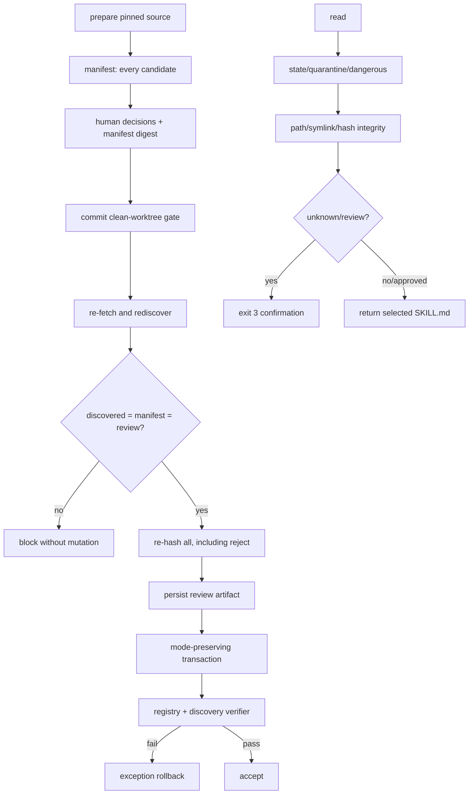

# Trust Boundary Hardening Implementation Plan

> **For agentic workers:** REQUIRED SUB-SKILL: Use superpowers:subagent-driven-development (recommended) or superpowers:executing-plans to implement this plan task-by-task. Steps use checkbox (`- [ ]`) syntax for tracking.

**Goal:** Close the multi-source registry's auditability, verifier, transaction, and operational gaps without changing the on-demand Librarian architecture.

**Architecture:** Keep `registry/skills.json` authoritative, `librarian-index.json` discovery-only, and the CLI as the sole runtime. Harden `prepare-source -> review -> commit-source` by proving complete candidate coverage and preserving deterministic review evidence; then make strict verification cover every search dependency, preserve file modes, and check integrity before asking for risk approval.

**Tech Stack:** Python 3.11–3.14, standard library, PyYAML, pytest, GitHub Actions, GitHub branch protection, Bash Recovery Kit verifier.

## Global Constraints

- No new runtime dependency.
- Keep registry schema version `1` unless additive source-review metadata cannot be parsed safely.
- No MCP, embeddings, vector database, hosted service, GUI, marketplace, or bulk installer.
- Do not modify or fork Official Superpowers.
- Do not import a third source until PRs 1–3 merge green.
- Preserve upstream bundle bytes; canonicalize through metadata instead of deleting catalog directories.
- Preserve `search`, `read`, `refresh`, and Librarian interfaces except correcting integrity-versus-confirmation ordering.
- Use isolated worktrees; never dirty `~/.agents/agentic-skill-registry`.
- Use TDD, one implementation agent, spec review, and quality/security review per task.

---

## Audited baseline and failures

Current baseline at `b5233bb3c1726f33962c45ed9d4b0cd702f776ca`:

```text
228 passed in 94.34s
result=pass failed=0
```

Reproduced gaps:

1. MicrosoftDocs pilot review manifest is not retained, so 190 rejection decisions are not independently auditable.
2. `commit_source()` does not compare the pinned discovered set with the manifest set and skips hash validation for rejected candidates.
3. Removing one discovery entry still lets strict verification pass while search fails.
4. Malformed registry JSON produces a traceback.
5. Atomic write and rollback change mode `0644 -> 0600`.
6. A modified unknown skill asks for confirmation before reporting hash mismatch.
7. Four exact Office duplicate pairs have no canonical link and appear twice in search.
8. README reports 1,952 active records; registry contains 1,953.
9. Live Python is 3.14.6; CI covers only 3.11–3.13.
10. `main` has no protection; Recovery Kit detects only symlink catalog mirrors.

## Target pipeline



## PR dependency graph

```text
PR 1 Reviewed intake evidence ─┐
                               ├─> PR 3 Transaction/read policy
PR 2 Strict verifier closure ──┘             │
                                             v
                                  PR 4 Operational cleanup
                                             │
                                             v
                                      independent audit
```

PRs 1 and 2 may use separate worktrees. PR 3 starts from main containing both. PR 4 starts after PR 3.

## File map

- `pipeline/skill_registry/intake.py`: complete candidate equality, rejected hash validation, review artifact, mutation guard.
- `pipeline/skill_registry/filesystem.py`: mode-preserving atomic byte replacement.
- `pipeline/skill_registry/validator.py`: malformed-input findings, discovery reconciliation, review-artifact validation.
- `pipeline/skill_registry/runtime.py`: integrity before confirmation.
- `registry/sources.lock.json`: explicit legacy/reviewed source status.
- `registry/source-reviews/*.json`: durable deterministic intake decisions.
- `registry/skills.json` and `librarian-index.json`: four canonical Office links.
- `tests/unit/test_intake.py`, `tests/contracts/test_validator.py`, `tests/unit/test_runtime.py`, `tests/integration/test_runtime_cli.py`: regression gates.
- `.github/workflows/ci.yml`: Python 3.14.
- `README.md` and `docs/source-intake.md`: exact guarantees and corrected counts.
- Recovery Kit `tools/mac-local/agentic-skills-library/*`: live mirror/MCP/runtime verification.

---

# PR 1 — Reviewed intake evidence

### Task 1: Require the complete pinned candidate set

**Files:**
- Modify: `pipeline/skill_registry/intake.py:850-875`
- Test: `tests/unit/test_intake.py`

**Interfaces:**
- Preserve `commit_source(root: Path, manifest_path: Path, review_path: Path) -> dict[str, object]`.
- Require `set(discovered) == set(manifest candidates) == set(review decisions)`.

- [ ] **Step 1: Write the failing truncated-manifest test**

Create two fake upstream bundles, prepare both, delete one from manifest and review, recompute `manifest_sha256`, then call commit:

```python
def test_commit_rejects_manifest_that_omits_pinned_candidate(
    valid_root, tmp_path, fake_checkout
):
    make_skill(fake_checkout / "skills", "omitted-skill")
    stage = tmp_path / "complete-stage"
    intake.prepare_source(valid_root, valid_source_spec(), stage)
    manifest_path = stage / "manifest.json"
    review_path = stage / "review.json"
    manifest = json.loads(manifest_path.read_text())
    manifest["candidates"] = [
        item for item in manifest["candidates"]
        if item["source_path"] != "skills/omitted-skill"
    ]
    write_json(manifest_path, manifest)
    review = json.loads(review_path.read_text())
    review["manifest_sha256"] = hashlib.sha256(
        manifest_path.read_bytes()
    ).hexdigest()
    review["decisions"] = [
        item for item in review["decisions"]
        if item["source_path"] != "skills/omitted-skill"
    ]
    review["decisions"][0].update({
        "decision": "reject",
        "reason": "Fixture scope rejection",
    })
    write_json(review_path, review)

    with pytest.raises(IntakeError, match="candidate set differs"):
        intake.commit_source(valid_root, manifest_path, review_path)
```

- [ ] **Step 2: Verify red**

```bash
PYTHONPATH=pipeline python -m pytest tests/unit/test_intake.py::test_commit_rejects_manifest_that_omits_pinned_candidate -q
```

Expected: FAIL because current commit iterates only reviewed paths.

- [ ] **Step 3: Add equality before mutation**

```python
discovered_paths = set(discovered)
manifest_paths = set(candidate_by_path)
review_paths = set(decision_by_path)
if discovered_paths != manifest_paths or manifest_paths != review_paths:
    raise IntakeError(
        "pinned candidate set differs from reviewed manifest: "
        f"discovered={len(discovered_paths)} "
        f"manifest={len(manifest_paths)} review={len(review_paths)}"
    )
```

Do not include candidate content or review reasons in errors.

- [ ] **Step 4: Add rejected-candidate hash regression**

```python
def test_commit_revalidates_rejected_candidate_hash(
    valid_root, manifest, prepared_paths, fake_checkout
):
    review = json.loads(prepared_paths[1].read_text())
    review["decisions"][0].update({
        "decision": "reject",
        "reason": "Fixture scope rejection",
    })
    write_json(prepared_paths[1], review)
    marker = fake_checkout / "skills/new-skill/SKILL.md"
    marker.write_text(marker.read_text() + "changed\n")
    with pytest.raises(IntakeError, match="changed since preparation"):
        intake.commit_source(valid_root, manifest, prepared_paths[1])
```

- [ ] **Step 5: Inspect every candidate before filtering rejects**

```python
for source_path in sorted(manifest_paths):
    bundle = discovered[source_path]
    inspected = inspect_bundle(bundle)
    expected = candidate_by_path[source_path]["content_sha256"]
    if inspected["content_sha256"] != expected:
        raise IntakeError(
            f"reviewed candidate changed since preparation: {source_path}"
        )
    if decision_by_path[source_path]["decision"] != "reject":
        inspected_by_path[source_path] = (bundle, inspected)
```

- [ ] **Step 6: Verify and commit**

```bash
PYTHONPATH=pipeline python -m pytest tests/unit/test_intake.py -q
git add pipeline/skill_registry/intake.py tests/unit/test_intake.py
git commit -m "fix: require complete reviewed source manifests"
```

**Acceptance:** Truncated manifests and changed rejected bundles fail before mutation.

### Task 2: Persist deterministic source review evidence

**Files:**
- Modify: `pipeline/skill_registry/intake.py`
- Modify: `pipeline/skill_registry/validator.py`
- Modify: `registry/sources.lock.json`
- Create: `registry/source-reviews/microsoftdocs-agent-skills-e03d6ea0dab78954ca902bad9f6556cafe772515.json`
- Test: `tests/unit/test_intake.py`
- Test: `tests/contracts/test_validator.py`
- Modify: `docs/source-intake.md`

**Source lock review shapes:**

```json
{"status": "legacy", "reason": "predates-reviewed-intake"}
```

or:

```json
{
  "status": "reviewed",
  "artifact": "registry/source-reviews/<source-id>-<commit>.json",
  "manifest_sha256": "<64-lowercase-hex>"
}
```

- [ ] **Step 1: Add artifact contract tests**

```python
def test_source_review_artifact_records_every_decision(manifest, valid_review):
    payload = intake.source_review_artifact(
        json.loads(manifest.read_text())["source"],
        manifest.read_bytes(),
        json.loads(manifest.read_text())["candidates"],
        valid_review["decisions"],
    )
    assert payload["manifest_sha256"] == hashlib.sha256(
        manifest.read_bytes()
    ).hexdigest()
    assert payload["candidate_count"] == len(payload["decisions"])
    assert all(item["content_sha256"] for item in payload["decisions"])
```

Add verifier tests for missing artifact, digest mismatch, duplicate path, wrong source ID/commit, wrong count, pending decision, and empty reason.

- [ ] **Step 2: Implement deterministic artifact builder**

```python
def source_review_artifact(source, manifest_bytes, candidates, decisions):
    candidate_by_path = {
        str(item["source_path"]): item for item in candidates
    }
    records = []
    for decision in sorted(
        decisions, key=lambda item: str(item["source_path"])
    ):
        candidate = candidate_by_path[str(decision["source_path"])]
        records.append({
            "source_path": decision["source_path"],
            "content_sha256": candidate["content_sha256"],
            "decision": decision["decision"],
            "taxonomy": decision["taxonomy"],
            "category_fine": decision["category_fine"],
            "canonical_skill_id": decision["canonical_skill_id"],
            "reason": decision["reason"],
        })
    return {
        "schema_version": 1,
        "source_id": source["source_id"],
        "source_commit": source["commit"],
        "manifest_sha256": hashlib.sha256(manifest_bytes).hexdigest(),
        "candidate_count": len(records),
        "decisions": records,
    }
```

No timestamp or reviewer field: Git author and commit time are the audit identity.

- [ ] **Step 3: Extend source-lock validation**

Mark `legacy-local` and `sickn33-agentic-awesome-skills` as `legacy`. Mark MicrosoftDocs `reviewed`. Reject absent or extra review fields and verify reviewed artifact source ID, commit, digest, count, unique paths, terminal decisions, and non-empty reasons.

Update every source-lock fixture in `tests/unit/test_intake.py`, `tests/unit/test_refresh.py`, and `tests/contracts/test_validator.py` to include one of the two accepted review shapes; do not weaken exact-field validation to keep old fixtures passing.

- [ ] **Step 4: Include artifacts in the transaction**

Use deterministic path:

```python
artifact_relative = (
    "registry/source-reviews/"
    f"{source['source_id']}-{source['commit']}.json"
)
```

Reject an existing artifact path. Write it atomically with registry JSON, reference it from the source lock, and delete only this newly created artifact on exception rollback.

- [ ] **Step 5: Reconstruct the Microsoft pilot**

Run preparation against pinned commit `e03d6ea0dab78954ca902bad9f6556cafe772515`. Set only `skills/azure-blob-storage` to import with taxonomy `devops-and-security/azure-cloud` and category `cloud`. Set all remaining decisions to reject with reason `pilot-scope-limited`. Generate the artifact without mutating catalog.

Mechanical acceptance:

```python
import json
p = json.load(open(
    "registry/source-reviews/"
    "microsoftdocs-agent-skills-"
    "e03d6ea0dab78954ca902bad9f6556cafe772515.json"
))
assert p["candidate_count"] == 191
assert sum(x["decision"] == "import" for x in p["decisions"]) == 1
assert sum(x["decision"] == "reject" for x in p["decisions"]) == 190
assert next(
    x for x in p["decisions"] if x["decision"] == "import"
)["source_path"] == "skills/azure-blob-storage"
```

- [ ] **Step 6: Run PR 1 gate**

```bash
PYTHONPATH=pipeline python -m pytest tests/unit/test_intake.py tests/contracts/test_validator.py -q
PYTHONPATH=pipeline python -m skill_registry.cli verify --strict
git diff --check
git add pipeline/skill_registry/intake.py pipeline/skill_registry/validator.py tests registry docs/source-intake.md
git commit -m "feat: preserve reviewed source evidence"
```

**PR 1 completion:** `191 = 1 import + 190 reject` is durable; every future pinned candidate is represented and re-hashed.

---

# PR 2 — Strict verifier closure

### Task 3: Return structured findings for malformed inputs

**Files:**
- Modify: `pipeline/skill_registry/validator.py`
- Test: `tests/contracts/test_validator.py`
- Test: existing verifier CLI integration file.

**Produces:** check ID `registry.input`.

- [ ] **Step 1: Add malformed JSON tests**

```python
@pytest.mark.parametrize("relative", [
    "registry/skills.json",
    "registry/core.json",
    "registry/sources.lock.json",
    "librarian-index.json",
])
def test_verify_reports_malformed_json_without_raising(
    repo_root, tmp_path, relative
):
    root = clone_repository_fixture(repo_root, tmp_path)
    if relative == "librarian-index.json":
        (root / relative).write_bytes(
            (repo_root / relative).read_bytes()
        )
    (root / relative).write_text("{")
    report = verify_repository(root)
    assert report.result == "fail"
    assert "registry.input" in {
        item["check_id"] for item in report.findings
    }
```

CLI test: exit `1`, no `Traceback`, finding contains `registry.input`.

- [ ] **Step 2: Verify red**

```bash
PYTHONPATH=pipeline python -m pytest tests/contracts/test_validator.py -q
```

- [ ] **Step 3: Add a narrow public error boundary**

Move existing body to `_verify_repository`:

```python
def verify_repository(root: Path) -> VerificationReport:
    try:
        return _verify_repository(root)
    except (
        OSError,
        UnicodeError,
        json.JSONDecodeError,
        KeyError,
        TypeError,
        AttributeError,
    ) as error:
        findings = []
        add(
            findings,
            "registry.input",
            ["DR-08"],
            error=type(error).__name__,
        )
        return VerificationReport(
            "fail", 0, 1, 0, 0, tuple(findings)
        )
```

Do not expose absolute paths, JSON contents, or exception messages.

- [ ] **Step 4: Run and commit**

```bash
PYTHONPATH=pipeline python -m pytest tests/contracts tests/integration -q
git add pipeline/skill_registry/validator.py tests/contracts tests/integration
git commit -m "fix: report malformed registry inputs"
```

### Task 4: Reconcile the discovery index

**Files:**
- Modify: `pipeline/skill_registry/validator.py`
- Test: `tests/contracts/test_validator.py`

**Produces:** check ID `registry.discovery-index`.

- [ ] **Step 1: Add missing, duplicate, wrong-count, extra, and malformed-entry tests**

Each test copies `librarian-index.json` into the fixture, applies one mutation, and asserts `registry.discovery-index`.

- [ ] **Step 2: Implement exact reconciliation**

Validate:

- `schemaVersion == 1`.
- `entries` is a list and `count == len(entries)`.
- `flat_name` is unique.
- `flat_name` set equals active registry plus quarantine `load_name` set.
- `taxonomy`, `category_fine`, and `description` are non-empty strings.
- Optional `skill_id`, when present, matches the joined registry record.
- Index risk, hash, and license remain non-authoritative.

Core comparison:

```python
expected_names = {
    record["load_name"]
    for record in [*skills, *quarantine]
    if isinstance(record.get("load_name"), str)
}
actual_names = [
    entry.get("flat_name")
    for entry in entries
    if isinstance(entry, dict)
]
if (
    payload.get("schemaVersion") != 1
    or payload.get("count") != len(entries)
    or len(actual_names) != len(set(actual_names))
    or set(actual_names) != expected_names
    or any(not valid_discovery_entry(x) for x in entries)
):
    add(findings, "registry.discovery-index", ["DR-08"])
```

- [ ] **Step 3: Repeat the audit reproduction**

In a disposable clone remove `azure-blob-storage` metadata. Expected after fix:

```text
verify exit 1
check_id=registry.discovery-index
search failure is no longer hidden by strict pass
```

- [ ] **Step 4: Run PR 2 gate**

```bash
PYTHONPATH=pipeline python -m pytest tests/contracts tests/unit/test_runtime.py tests/integration -q
PYTHONPATH=pipeline python -m skill_registry.cli verify --strict
git diff --check
git add pipeline/skill_registry/validator.py tests/contracts/test_validator.py
git commit -m "feat: verify discovery index consistency"
```

**PR 2 completion:** strict pass implies all JSON is parseable and every search dependency reconciles.

---

# PR 3 — Transaction and read policy

### Task 5: Preserve modes and avoid rollback before mutation

**Files:**
- Modify: `pipeline/skill_registry/filesystem.py`
- Modify: `pipeline/skill_registry/intake.py`
- Create: `tests/unit/test_filesystem.py`
- Test: `tests/unit/test_intake.py`
- Modify: `docs/source-intake.md`

**Guarantee:** Python exceptions restore exact bytes and permission bits. This PR does not claim process-kill or power-loss atomicity across multiple files.

- [ ] **Step 1: Add red mode tests**

```python
def test_atomic_json_preserves_existing_mode(tmp_path):
    path = tmp_path / "registry.json"
    path.write_text("{}\n")
    path.chmod(0o644)
    filesystem.dump_json_atomic(path, {"value": 1})
    assert path.stat().st_mode & 0o777 == 0o644

def test_atomic_json_uses_readable_mode_for_new_file(tmp_path):
    path = tmp_path / "registry.json"
    filesystem.dump_json_atomic(path, {"value": 1})
    assert path.stat().st_mode & 0o777 == 0o644
```

- [ ] **Step 2: Add one stdlib byte replacement helper**

```python
def replace_bytes_atomic(path: Path, content: bytes) -> None:
    path.parent.mkdir(parents=True, exist_ok=True)
    mode = (
        path.stat().st_mode & 0o777
        if path.exists()
        else 0o644
    )
    temporary = None
    try:
        with tempfile.NamedTemporaryFile(
            mode="wb",
            dir=path.parent,
            prefix=f".{path.name}.",
            suffix=".tmp",
            delete=False,
        ) as handle:
            temporary = Path(handle.name)
            handle.write(content)
        temporary.chmod(mode)
        temporary.replace(path)
    except Exception:
        if temporary is not None:
            temporary.unlink(missing_ok=True)
        raise
```

Make `dump_json_atomic()` serialize once and call this helper. Replace duplicate rollback writer with the helper.

- [ ] **Step 3: Add pre-mutation failure test**

Capture bytes, mode, and mtime of repository JSON. Inject failure during preflight. Assert none changed. Add `mutation_started = False` and restore snapshots only after it becomes true immediately before the first catalog or JSON mutation.

- [ ] **Step 4: Correct transaction documentation**

Document exception-safe rollback. For process kill or power loss: inspect `git status`, run strict verifier, then use `git restore` or revert the source-intake commit. Do not call the operation globally atomic or crash-safe.

- [ ] **Step 5: Run and commit**

```bash
PYTHONPATH=pipeline python -m pytest tests/unit/test_filesystem.py tests/unit/test_intake.py -q
git add pipeline/skill_registry/filesystem.py pipeline/skill_registry/intake.py tests/unit docs/source-intake.md
git commit -m "fix: preserve registry modes during rollback"
```

### Task 6: Verify integrity before approval

**Files:**
- Modify: `pipeline/skill_registry/runtime.py:130-190`
- Test: `tests/unit/test_runtime.py`
- Test: `tests/integration/test_runtime_cli.py`
- Modify: `README.md`

- [ ] **Step 1: Add the failing order test**

```python
@pytest.mark.parametrize("risk", ["unknown", "review"])
def test_unreviewed_hash_mismatch_blocks_before_confirmation(
    tmp_path, risk
):
    record = build_registry(
        tmp_path, [{"name": "candidate", "risk": risk}]
    )[0]
    marker = tmp_path / record["catalog_path"] / "SKILL.md"
    marker.write_text(marker.read_text() + "modified\n")
    with pytest.raises(SkillBlocked, match="hash mismatch"):
        read_skill(tmp_path, record["skill_id"])
```

- [ ] **Step 2: Reorder `read_skill()`**

Exact order:

```text
record lookup
quarantine and active-state checks
dangerous block
catalog containment and SKILL.md
symlink/tree hash and registered hash
unknown/review confirmation
read SKILL.md
```

The approved call repeats the full function, so it repeats integrity without a second in-call hash.

- [ ] **Step 3: Add CLI regression**

Unknown hash mismatch: exit `1`, empty stdout, `hash mismatch` in stderr, no `confirmation_required`. Existing valid unknown: exit `3` and no instructions.

- [ ] **Step 4: Run PR 3 gate**

```bash
PYTHONPATH=pipeline python -m pytest tests/unit/test_runtime.py tests/integration/test_runtime_cli.py tests/unit/test_intake.py tests/unit/test_filesystem.py -q
PYTHONPATH=pipeline python -m pytest -q
PYTHONPATH=pipeline python -m skill_registry.cli verify --strict
git diff --check
git add pipeline/skill_registry/runtime.py tests README.md
git commit -m "fix: verify skill integrity before approval"
```

**PR 3 completion:** existing files keep `0644`, preflight errors do not rewrite files, invalid unknown skills exit `1`, and only integrity-valid unknown/review skills exit `3`.

---

# PR 4 — Operational cleanup

### Task 7: Canonicalize exact Office duplicates and align status

**Files:**
- Modify: `registry/skills.json`
- Modify: `librarian-index.json`
- Modify: `README.md`
- Modify: `.github/workflows/ci.yml`
- Test: `tests/integration/test_search_quality.py`
- Test: `tests/contracts/test_validator.py`

- [ ] **Step 1: Add one-result search tests**

```python
@pytest.mark.parametrize(
    ("query", "target", "hidden"),
    [
        ("docx", "docx-official", "docx"),
        ("pdf", "pdf-official", "pdf"),
        ("pptx", "pptx-official", "pptx"),
        ("xlsx", "xlsx-official", "xlsx"),
    ],
)
def test_office_duplicates_have_one_searchable_target(
    repo_root, query, target, hidden
):
    names = [
        item["load_name"]
        for item in search_skills(repo_root, query, 10)["matches"]
    ]
    assert target in names
    assert hidden not in names
```

- [ ] **Step 2: Set canonical links without deleting catalog**

| Legacy | Canonical target |
|---|---|
| `asr_091a11ed65e6d48c` docx | `asr_e6c8dc8653aa3354` docx-official |
| `asr_a2ed4cebcd55986b` pdf | `asr_a3eb24a0d9be8c5e` pdf-official |
| `asr_0d9890d5538cb977` pptx | `asr_9de67dbe1c67925b` pptx-official |
| `asr_92f7be88c94488c2` xlsx | `asr_b543a3233817a3b4` xlsx-official |

Update both registry `canonical_skill_id` and discovery `canonical` fields.

- [ ] **Step 3: Correct README**

Report:

```text
1,953 active registry records
1,949 searchable non-canonical records
2 quarantined records
1 audited Core skill
```

Clarify: 14 process `SKILL.md` files match Obra v6.1.1; OpenAI curated packaging can add OpenAI metadata. This registry does not fork or patch process skills.

- [ ] **Step 4: Add Python 3.14 CI**

```yaml
python-version: ["3.11", "3.12", "3.13", "3.14"]
```

- [ ] **Step 5: Run and commit**

```bash
PYTHONPATH=pipeline python -m pytest tests/integration/test_search_quality.py tests/contracts/test_validator.py -q
PYTHONPATH=pipeline python -m pytest -q
PYTHONPATH=pipeline python -m skill_registry.cli verify --strict
git diff --check
git add registry/skills.json librarian-index.json README.md .github/workflows/ci.yml tests
git commit -m "fix: canonicalize exact Office duplicates"
```

### Task 8: Strengthen workstation verification and protect main

**Files outside this Git repo:**
- Recovery Kit `tools/mac-local/agentic-skills-library/verify.sh`
- Recovery Kit `tools/mac-local/agentic-skills-library/README.md`
- Recovery Kit `tools/mac-local/agentic-skills-library/status.md`
- Owner `profiles/owners/winston/logs/change-history.md`
- GitHub protection for `hbui290/agentic-skill-registry/main`

- [ ] **Step 1: Detect physical catalog copies by exact tree hash**

Use the CLI interpreter and installed hashing implementation:

```bash
CLI_PY=$(sed -n '1s/^#!//p' "$(command -v skill-registry)")
"$CLI_PY" - "$ROOT" "$HOME/.codex/skills" <<'PY'
import json, pathlib, sys
from skill_registry.hashing import UnsafeCatalogPath, tree_sha256
root, native = map(pathlib.Path, sys.argv[1:])
registered = {
    item["content_sha256"]
    for item in json.loads(
        (root / "registry/skills.json").read_text()
    )["skills"]
}
matches = []
for path in native.iterdir():
    if not path.is_dir() or path.name == "skill-librarian":
        continue
    try:
        if tree_sha256(path) in registered:
            matches.append(path.name)
    except UnsafeCatalogPath:
        continue
raise SystemExit(1 if matches else 0)
PY
```

Keep the symlink-path diagnostic too. Test exact-copy failure only under a temporary fake HOME.

- [ ] **Step 2: Run Recovery Kit gates**

```bash
bash tools/mac-local/agentic-skills-library/verify.sh
bash ops/verify/tool_registry.sh
bash ops/verify/kit_consistency.sh
```

- [ ] **Step 3: Merge PR 4 and discover real check names**

```bash
gh api repos/hbui290/agentic-skill-registry/commits/main/check-runs --jq '.check_runs[].name' | sort -u
```

Expected: `test (3.11)`, `test (3.12)`, `test (3.13)`, `test (3.14)`, `strict-verifier`. Stop if names differ.

- [ ] **Step 4: Enable protection**

Apply protection with strict required status checks, admin enforcement, linear history, conversation resolution, no force push, and no deletion. Do not require one approving review because a solo owner cannot approve their own PR. Use the discovered check names, not guessed names.

- [ ] **Step 5: Verify and record**

```bash
gh api repos/hbui290/agentic-skill-registry/branches/main/protection --jq '{admin: .enforce_admins.enabled, contexts: .required_status_checks.contexts}'
bash "/Users/0xharry/Library/Mobile Documents/com~apple~CloudDocs/Archives/AI_WORKSTATION_RECOVERY_KIT/tools/mac-local/agentic-skills-library/verify.sh"
```

Record merged commit, verifier output, and protection state without secrets.

---

## Full verifier

Run in a fresh clone:

```bash
git diff --check
PYTHONPATH=pipeline python -m pytest -q
PYTHONPATH=pipeline python -m skill_registry.cli verify --strict
```

Policy acceptance:

- Azure top 5.
- Azure read exit `3`, empty stdout, no instructions.
- `pdf/docx/pptx/xlsx` searches return only `*-official` target.
- Missing discovery entry fails `registry.discovery-index`.
- Malformed JSON fails `registry.input` without traceback.
- Modified unknown skill exits `1 hash mismatch` before confirmation.
- Microsoft artifact proves 191 unique decisions: one import and 190 reject.
- GitHub CI passes Python 3.11–3.14 and strict verifier.
- Recovery Kit passes with no MCP, no symlink mirror, and no exact physical catalog copy.

## Independent review gates

For every task:

1. Fresh implementation subagent edits only listed files.
2. Spec reviewer checks acceptance and rejects extra scope.
3. Quality/security reviewer checks trust-boundary ordering, error leakage, rollback, and tests.
4. Main agent runs focused tests before accepting the commit.

Before each PR merge:

- full tests and strict verifier from clean checkout;
- fresh whole-diff review;
- GitHub CI green;
- no unrelated catalog byte changes;
- no new runtime dependency.

After all PRs: independent read-only auditors for intake provenance, verifier corruption, live workstation drift, and Ponytail diff review. Do not reuse implementers as final auditors.

## Rollback

- Revert one PR at a time; never hand-edit catalog/registry to imitate rollback.
- PR 1 removes review artifact and source-lock review metadata together.
- PR 2 rollback changes verifier only.
- PR 3 rollback restores previous writer/read ordering only if focused regression fails.
- PR 4 rollback clears four canonical links; catalog trees remain.
- Capture existing GitHub protection first. Audited current state is no protection and zero rulesets.
- Recovery Kit rollback uses its owner history; Librarian and Official Superpowers remain installed.

## Stop conditions

Stop and do not merge if:

- baseline, focused tests, full tests, strict verifier, or required CI fails;
- Microsoft pin does not reconstruct exactly 191 candidates;
- pilot artifact is not exactly one Azure import plus 190 explicit rejections;
- discovered, manifest, and review path sets differ;
- any rejected candidate hash differs;
- unrelated catalog bytes change;
- transaction failure changes existing bytes or permission bits;
- invalid path/symlink/marker/hash reaches confirmation;
- discovery reconciliation cannot explain all active and quarantined names;
- branch check names differ from successful main check names;
- any PR adds MCP, embeddings, hosted service, bulk installer, or runtime dependency.

## Definition of done

Complete only when:

- every source is explicitly legacy or has deterministic review evidence;
- incomplete manifests and changed rejects are blocked;
- strict verifier covers every search input;
- malformed input never traces back;
- exception rollback preserves bytes and modes;
- integrity failure precedes confirmation;
- four Office pairs keep provenance but expose one searchable target;
- counts are accurate;
- Python 3.11–3.14 and strict verifier protect main;
- Recovery Kit detects exact physical mirrors;
- final independent audit finds no unresolved 2026-07-17 Critical or Watch issue.

## Execution handoff

Recommended: `superpowers:subagent-driven-development`, one fresh implementer and two review gates per task. Use four feature branches according to the dependency graph. Do not execute from this documentation worktree.
